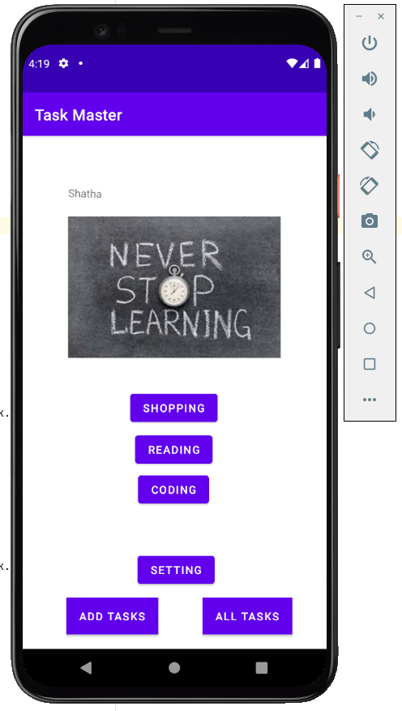
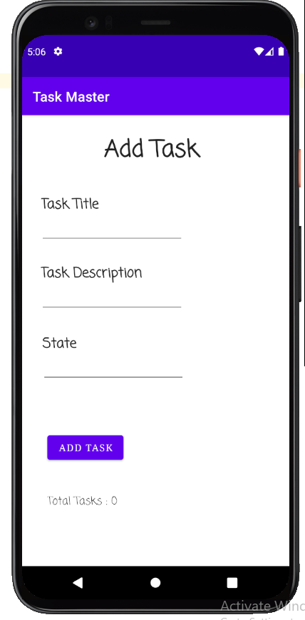
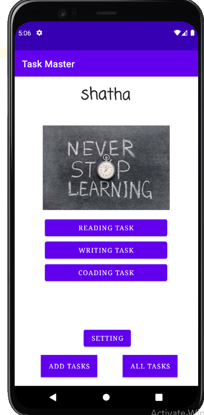
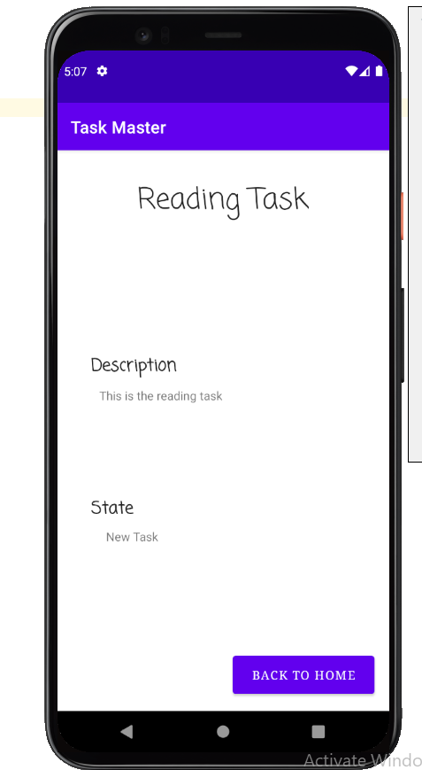
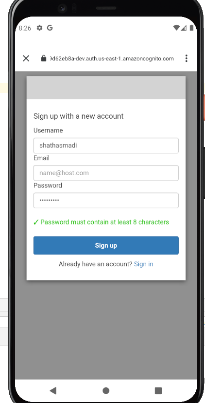
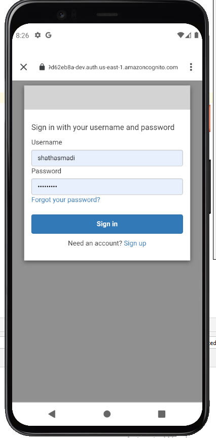
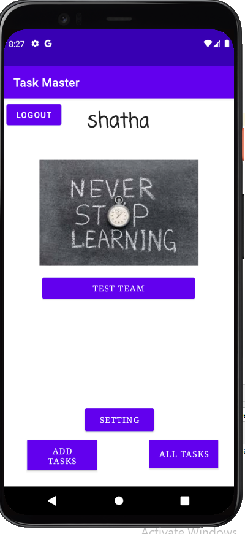

## Task Master
- It should have a heading at the top of the page, an image to mock the “my tasks” view, and buttons at the bottom of the page to allow going to the “add tasks” and “all tasks” page.

-  Allow users to type in details about a new task, specifically a title and a body. When users click the “submit” button, show a “submitted!” label on the page.

- Should just be an image with a back button

***

## Lab 27 :

# Homepage
- The main page should be modified to contain three different buttons with hardcoded task titles. When a user taps one of the titles, it should go to the Task Detail page, and the title at the top of the page should match the task title that was tapped on the previous page.

The homepage should also contain a button to visit the Settings page, and once the user has entered their username, it should display “{username}’s tasks” above the three task button

# Settings Page

- Create a Settings page. It should allow users to enter their username and hit save.

# Task Detail Page
- Create a Task Detail page. It should have a title at the top of the page, and a Lorem Ipsum description.

***

## lab 28 :

# Task Model

- Create a Task class. A Task should have a title, a body, and a state. The state should be one of “new”, “assigned”, “in progress”, or “complete”.

# Homepage

Refactor your homepage to use a RecyclerView for displaying Task data. This should have hardcoded Task data for now.

Some steps you will likely want to take to accomplish this:

   - Create a ViewAdapter class that displays data from a list of Tasks.
   -  In your MainActivity, create at least three hardcoded Task instances and use those to populate your RecyclerView/ViewAdapter.

Ensure that you can tap on any one of the Tasks in the RecyclerView, and it will appropriately launch the detail page with the correct Task title displayed.

***

## lab 29 :

# Task Model and Room

- Following the directions provided in the Android documentation, set up Room in your application, and modify your Task class to be an Entity.

# Add Task Form

- Modify your Add Task form to save the data entered in as a Task in your local database.

# Homepage

- Refactor your homepage’s RecyclerView to display all Task entities in your database.

# Detail Page

- Ensure that the description and status of a tapped task are also displayed on the detail page, in addition to the title. (Note that you can accomplish this by passing along the entire Task entity, or by passing along only its ID in the intent.)

***

## lab 31: 
+ added Espresso testing to the application.
+ testing for the buttons on home page of they have the proper naming.
+ testing the add task fuctionality and check if it apears in Main page.
+ testing the setting page changing username functionality and check if it apears on main page.

 ***
## lab 32 :

- Is to use AWS Amplify as a backend. 

## Feature Tasks
- To use AWS Amplify to access the application data in DynamoDB instead of in Room.

## Add Task Form
- Modify your Add Task form to save the data entered in as a Task to DynamoDB.

## Homepage
- Refactor homepage’s RecyclerView to display all Task entities in DynamoDB.

## lab 33 :

- In this lab the add task activity now add the new task to the amplify api with the team, also in the settings activity the user now can choose his team and the tasks will appear in the homepage based on his team.

## lab 36:

- User Login

Add Cognito to your Amplify setup. Add in user login and sign up flows to your application, using Cognito’s pre-built UI as appropriate. Display the logged in user’s username somewhere relevant in your app.

- User Logout

Allow users to log out of your application.

## lab 37:

   - Is to allow users to upload files related to tasks, like screenshots or log files.

## Feature Tasks

# Uploads

   - On the Add a Task activity, allow users to optionally select a file to attach to that task.
   - If a user attaches a file to a task, that file should be uploaded to S3, and associated with that task.

# Displaying Files

- On the Task detail activity.
- If there is a file that is an image associated with a particular Task, that image should be displayed within that activity.

## lab41 :

- adding the ability to make new task from another applications by using the share text.